# Machine Learning Engineer Nanodegree
## Capstone Project
Frank Ding  
2018


## I. Definition
### Project Overview
This capstone project is well defined by  [Udacity MLND Robot Motion Planning Capstone Project - Plot and Navigate a Virtual Maze](https://docs.google.com/document/d/1ZFCH6jS3A5At7_v5IUM5OpAXJYiutFuSIjTzV_E-vdE/pub) whose original idea takes inspiration from Micromouse competitions, which originated in the late 1970s as an event where small robot mice solve a 16 x 16 maze. The autonomous micromouse robot is placed in a corner of the maze and is taksked to reach maze center. The mouse is given two runs in the maze. In the first run, it attempts to map out the maze to not only find the center, but also figure out the best paths to the center. In second run, the micromouse robot aims to reach the center in the fastest time possible.


### Problem Statement
The goal is to design a algorithm that makes the micromouse robot find the center as quick as possible. To be most efficient includes not only the moves in the second run but also the moves in the first run, ie. explore the maze in an efficient way. More concretely, the score is defined as follows
$$ Score = NumSteps_1/30 + NumSteps_2 $$ 

where $NumSteps_1​$ is number of steps taken in first run and $NumSteps_2​$ is number of steps in second run, capped by $NumSteps_1 < 1000​$, $NumSteps_2 < 1000​$

The rationale of the metric is further explained in [Metrics section](#metrics).

The guiding problem solving principles are

* In second run, calculate a shortest path using partial knowledge of the maze acquired in first run because trials in second run would not be economical since exploration incurs 1/30 cost in trial stage than in second stage.
* In first run, the robot is required to reach goal due to first principle. Since there is restriction on total number of steps and also number of steps in this stage has metric impact, it's wise for the robot to reach goal in minimal steps. This stage in first run is called **goal searching exploration** in this report.
* And if remaining steps allowed, the robot can explore other unexplored squares as many as possible in the maze in most efficient way in the hope to find shortcut path for next stage. This continuing exploration in first run can be considered as optimization so it is called **continuing exploration** in this report.  It must make trade-off between the number of step expected to be taken and number of steps that a promising shortcut path could reduce compared to existing shortest path.

Hence, the first principle would lead naturally to calculating shortest path using Dijkstra shortest path algorithm.

The second principle would make us find quickest paths while exploring using graph traveral algorithms such as A* search algorithms because aimless wondering would increase the possibility of failing to reach goal.

The third principle forces designers to prefer depth first search graph traversal algorithms  than breadth first ones because breadth first search incurs more step cost due to back and forth movements. However, how to exploit existing knowledge of the maze and the effectiveness of making bet on moving to unexplored cells are unknown.


### Metrics
The evaluation metric is listed below
$$ Score = NumSteps_1/30 + NumSteps_2 $$

where $NumSteps_1$ is number of steps taken in first run and $NumSteps_2$ is number of steps in second run, capped by $NumSteps_1 < 1000$, $NumSteps_2 < 1000$

The total score not only considers total steps taken in test run but also involves steps in exploration run. Think about why it is necessary to include steps in exploration run. Suppose total score only considered step number in test run, i.e $Score = NumSteps_2$, robot is encouraged to take arbitrary time probing the maze and have a complete knowledge of the maze. Then in the second run, some deterministic  shortest path algorithm can be employed to compute minimal steps. The overall result would be that every robot has the optimal score for a particular maze though they have wide range of steps probing the maze. Worst is that some robot may never terminiate in exploration run. 


## II. Analysis
### Data Exploration

Udacity provides starter code including the following files:

- robot.py - This script establishes the robot class. This is the only script that you should be modifying, and the main script that you will be submitting with your project.
- maze.py - This script contains functions for constructing the maze and for checking for walls upon robot movement or sensing.
- tester.py - This script will be run to test the robot’s ability to navigate mazes.
- showmaze.py - This script can be used to create a visual demonstration of what a maze looks like.
- test_maze_##.txt - These files provide three sample mazes upon which to test your robot. 


Maze is inputed as a text file. On the first line of the text file is a number describing the number of squares on each dimension of the maze n. On the following n lines, there will be n comma-delimited numbers describing which edges of the square are open to movement. Each number represents a four-bit number that has a bit value of 0 if an edge is closed (walled) and 1 if an edge is open (no wall); the 1s register corresponds with the upwards-facing side, the 2s register the right side, the 4s register the bottom side, and the 8s register the left side. For example, the number 10 means that a square is open on the left and right, with walls on top and bottom (0\*1 + 1\*2 + 0\*4 + 1\*8 = 10). Note that, due to array indexing, the first data row in the text file corresponds with the leftmost column in the maze, its first element being the starting square (bottom-left) corner of the maze.


### Exploratory Visualization

#### Maze 1 (12x12)
Maze visualization can be produced by *show_maze.py* in starter code. Below is the picture illustrating maze 1.

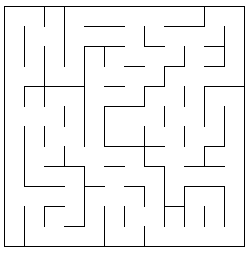

I enhanced visualization script in *vis.py*, with the following enhancements:
* cell coordinate is displayed
* cell status can be easily spotted by its color
* current cell together with its heading is denoted by red arrow
* route can be visualized as well


**Legend Explained**

Legend             |  Meaning
:-------------------------:|:--------------------------
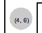  | fully explored cell<br>walls on left and right edges<br>top and bottom directions connect neighbouring cells 
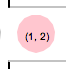  | not fully explored cell<br>unknown status of top and bottom directions 
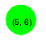 | goal cell 
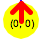 | current cell with heading 
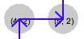 | route with direction and step 


Maze 1 is drawn below

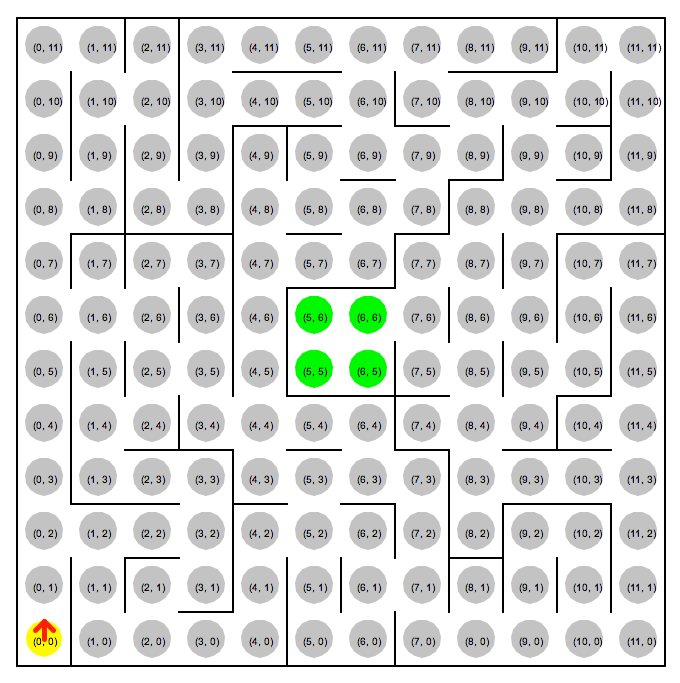

Illustration of single step shortest path.
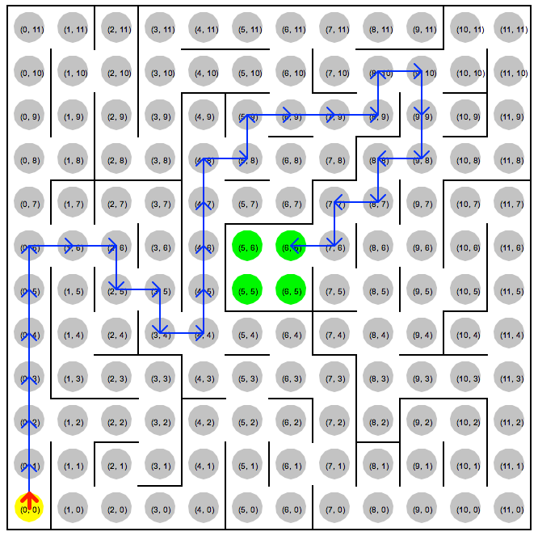


Because at most 3 steps are allowed, exploiting this parameter gives significant improvement.

Multi Step: total 17 actions             |  Single Step: total 30 actions
:-------------------------:|:-------------------------:
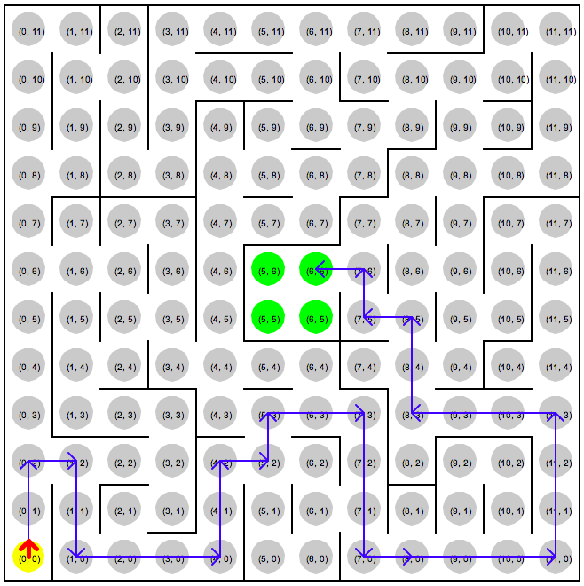  |  


#### Maze 2 (14x14)


Multi Step: total 22 actions             |  Single Step: total 43 actions
:-------------------------:|:-------------------------:
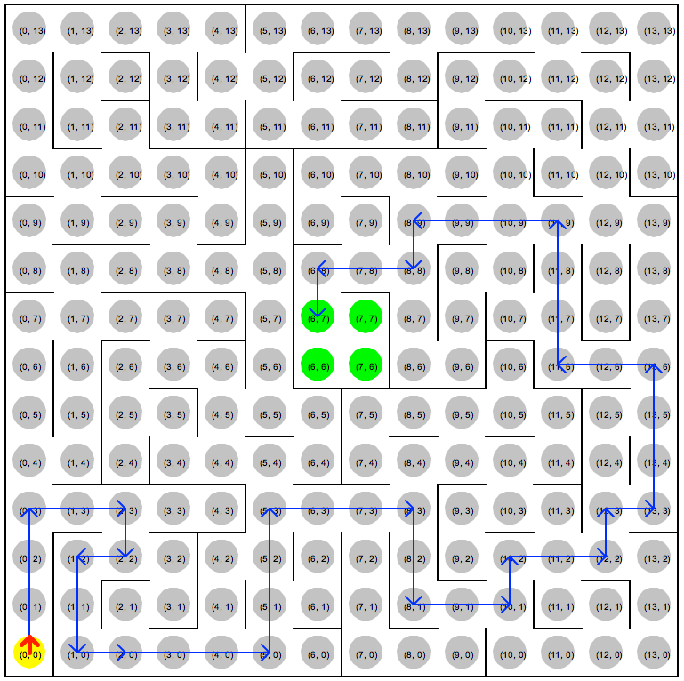  |  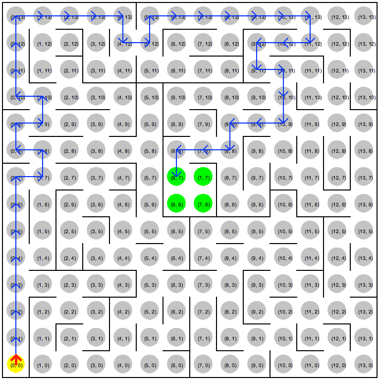


#### Maze 3 (16x16)


Multi Step: total 25 actions             |  Single Step: total 49 actions
:-------------------------:|:-------------------------:
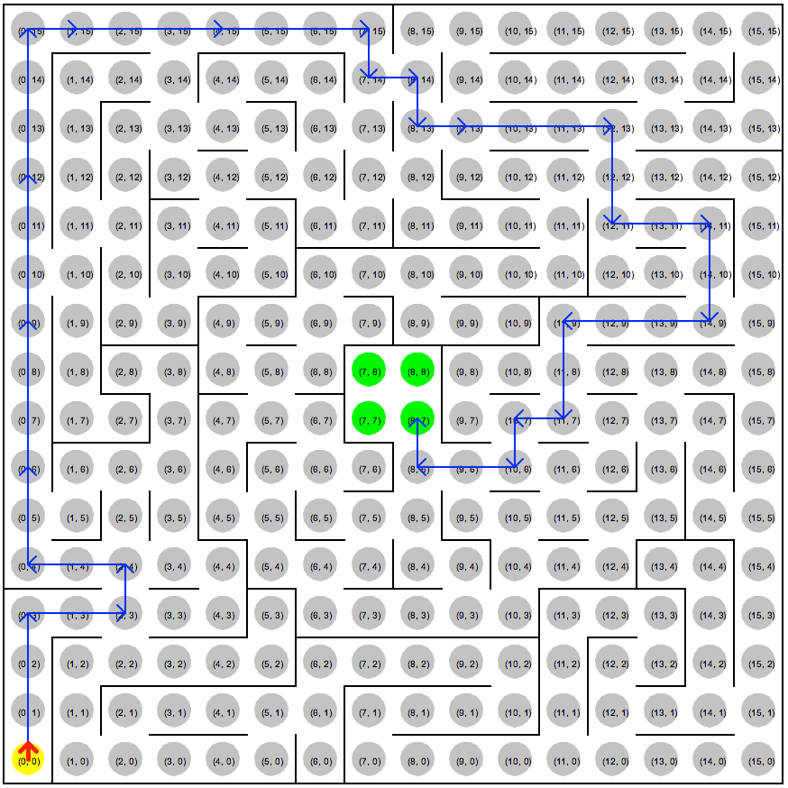  |  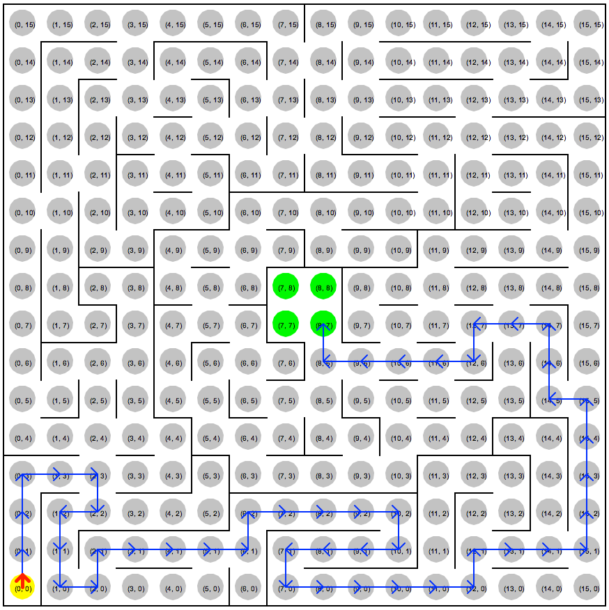


### Algorithms and Techniques

According to [Problem Statement section](#problem-statement), there are 3 stages: goal searching exploration, optimization exploration and second trial. In code implementation, I abstracted interfaces of these 3 stages so that they can be arbitrarily combined.


#### A. Strategies in goal searching exploration 

The corresponding abstract class is `SearchingExploration` described in [Implementation section](#implementation).


**One-Step Random Turn**

In a cell, a random turn with step size one is made. Because moving backward does not make mouse turn around direction, it's very likely that in next action it moves forward again. In order to decrease possibility of this going back and forth, only 3 actions are supported, namely, turning left, forward and turning right. However, there is also case where the mouse reaches dead end and hence the only way is to back off. In such case, turning right with no progress is returned.

Another optimization is that random guess is guaranteed not to include one step progress in the direction that hits a wall.

Strategy instantialization: `SearchingExploration_WeightedRandom()`.


**One-Step Weighted Random Turn** 

Similar to One-Step Random Turn above, but weights of 3 actions can be customized to favor certain actions. For example, turn_weights=[2, 5, 2] means the weights of turning left, forward, turning right are 2, 5, and 2 respectively. Note that if action would lead to hit wall, the corresponding weight is would be zero, i.e. weighted random action is also guaranteed not to hit a wall.

Strategy instantialization: `SearchingExploration_WeightedRandom(turn_weights=[2, 5, 2])`


**One-Step Favoring Unexplored Cell**

Instead of random guess, action is determined by how much neighbouring cells are unexplored. By unexplored, we mean at least one edge of the cell is not identified. Use unexplored num as weight and then randomly guess one action.


**One-Step Favoring Unexplored Space**

An extended strategy of One-Step Favoring Unexplored Cell above. The idea is that although a neibouring cell status has been determined, that does not mean no information would be gained if that path is followed. Actually, the neighbouring cell is likely to lead to a cluster of cells that are unexplored. So the weight becomes the total sum of unexplored cell number one neighbour could lead to.

Strategy instantialization: `SearchingExploration_OneStepFavorUnexploredSpace()`


**One-Step Wall Follower** 

Wall follower algorithm takes every left turn (left hand rule) possible but may get caught in loop. Further optimization is needed if it is guaranteed to reach goals.

Strategy instantialization: `SearchingExploration_LeftHandRule()`

Below shows a loop when applied to maze 1:

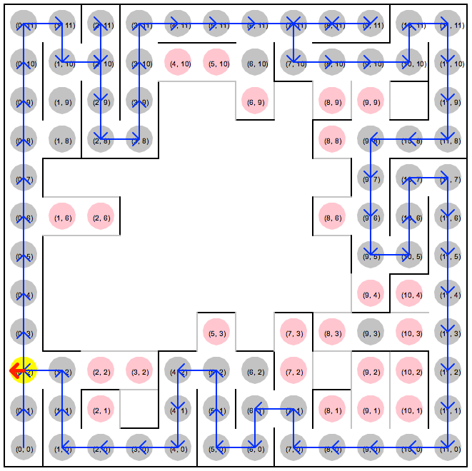


**Multi-Step Goal Oriented (A\*) **

A\* is an informed search or best-first search algorithm that generalizes Dijkstra shortest path algorithm. The issue of all graph shortest path algorithms is that traversal of the graph is costly and enumerating all possible paths would normally form a huge space to search. A\* enjoys its efficiency reputation of being efficient by selecting node to be expand smartly. The intuition behind it is straightforward: like human, we always seek to try node that appears to lead most quickly to the solution. seems to be most promising.  Technically, it employs heuristic function to assist it evaluating most promising node. The code of A\* and Dijkstra is almost the same except cost in A\* now has two parts: 

$$f(n) = g(n) + h(n) $$

The cost function $f(n)$ is defined to be sum of actual distance and heuristic estimate of the distance from $n$ to goal state.

Similar to Dijkstra, at certain cell $k$, we need to consider all reachable unexplored cells $n_i$ and sort their $f(n)$ ascendingly and then take action to most promising (closest) one.

One nice property about A\* is the admissible where A\* is guaranteed to find shortest path as long as the heuristic function never overestimates the actual minimal cost of reaching the goal. A typical admissible heuristic function in maze-like situation is manhattan distance because one can never take less steps reaching goal than manhattan distance. So normally cost function would be defined as:

$$f(n) = cost\_from\_start\_to(n) + manhattan\_dist\_to\_goal(n) $$

where $cost\_from\_start\_to(n)$ is the actual steps taken from cell (0, 0) to cell $n$ and $manhattan\_dist\_to\_goal(n) $ is manhattan distance from cell $n$ to goal cells and let our current cell be $k$. If we follow this strategy in first run, it is guaranteed to find shortest path in second run. However, the score counts steps in first run as well which means we cannot afford going back and forth arbitrarily to explore most promissing cell in theory. Instead, we must take account for the cost of moving from cell $k$ to cell $n$. Besides, $cost\_from\_start\_to(n)$ is still not decided because we are at cell $k$ and we might take $p$ steps to cell $k$, but $cost\_from\_start\_to(n) \neq cost\_from\_start\_to(k) + p$ in second run since we might find shortcut during the way.

The question is, in our situation, when the mouse is at cell $k$, we need to evaluate all unexplored cells in much the same way of A\* does and we must include the steps estimated to move from $k$ to next unexplored cell $n$.

**So we are not using A\* to find shortest path from starting cell to goal cells but use A\* to find next most promissing cell $n$ when at cell $k$.** This implies that we may not be guaranteed to find shortest path in second run.

In this situation, the cost function $f(n)$ is:
$$f(n) =  estimated\_steps(k, n) + manhattan\_dist\_to\_goal(n)$$

where $g(n) = estimated\_steps(k, n)$ and $h(n) = manhattan\_dist\_to\_goal(n)$. 

Note that $estimated\_steps(k, n)$ is estimation steps not actual steps from $k$ to $n$. In addition, to favor cells that have more unexplored edges, $explored\_edge\_num(n)$ is also added to $h(n)$. That is to say, in case we have 2 cells equally far from current cell $k$ and also having same manhattan distance to goals, we prefer the cell with more unexplored edges.

In summary, our cost and heuristic functions are listed below, given the fact that we use A\* to find next most promissing cell $n$ at cell $k$. 

$$h(n) = explored\_edge\_num(n) + manhattan\_dist\_to\_goal(n)$$

$$g(n) = estimated\_steps(k, n)$$


Stability or robustness of this algorithm is further discussed in [Solution Robustness section](#solution-robustness).

Strategy instantialization: `SearchingExploration_GoalOriented()`


#### B. Strategies in second trial

The corresponding abstract class is `CalcShortestPath` described in [Implementation section](#implementation).


**One-Step Dijkstra Shortest Path**

Once entering 2nd run, a shortest path starting from (0, 0) with current maze status is computed using Dijkstra shortest path algorithm. This strategy ignores further sensor updates along the way and applies action series computed at initialization. Each action would make one progress.

Strategy instantialization: `DijkstraStride()`


**Multi-Step Dijkstra Shortest Path**

Similar to One-Step Dijkstra Shortest Path strategy but with max step size being 3.

Strategy instantialization: `DijkstraStride(max_step=3)`


**Multi-Step Dijkstra Shortest Path with Sensor Updates**

This strategy differes from previous one in that it considers sensor updates along the way and re-computes actions for each movement.

Strategy instantialization: `DijkstraStrideWithUpdates(max_step=3)`.


#### C. Strategies in optimization exploration

The corresponding abstract class is `ContinuingExploration` described in [Implementation section](#implementation).

**No Optimization Exploration**

Default strategy because enabling stage is not guaranteed to improve score.


**Cover All Goals**

After reaching first goal cell, it continues to reach other 3 goal cells if necessary. The intuition is to spend very restricted cost in hope to find a shortcut for run 2.

Strategy instantialization: `ContinuingExploration_CoverAllGoals()`


**Coverage Threshold**

Continue to reach unexplored cell until it covers enough cells parameterized by user.


**With More AI**

The intuition is that given information of currently explored maze, there may not be worthy to explore remaining cells, even though there are lots of them. For example, a cell serves a hole of unexplored cell cluster and the only entry is itself, and this fact can be deduced by current maze status.


### Benchmark
The benchmark model strategy combination is **One-Step Weighted Random Turn** + **Multi-Step Dijkstra Shortest Path** + **No Optimization Exploration** and the result is given in [Model Evaluation and Validation section](# model-evaluation-and-validation). Because of stochastic nature, score is averaged across 5 trials. In case 1000 max step is exceeded, 100 would be the score.


## III. Methodology
### Data Preprocessing
No data preprocessing because the *test.py* script takes care of interaction between maze environment and the mouse.   `Robot.next_move()` is the sole hook method required to implement.


### Implementation

#### Implementation Principles
As Udacity machine learning capstone project, I want to achieve following implementation standards

* Readable: code is clearly documented and easy to be understood

* Composable: in order to test and compare different strategies of 3 phases identified in [Problem Statement section](#problem-statement), I abstracted each phase to one abstract class. Concrete strategy implements corresponding abstract class and is plugged into `Robot` constructor.

* Testable: those common routines such as manhattan distance, dijkstra shortest path algorithm, are separated out as standalone functions for test and resuable purposes. A dedicated unit test python script *robot_test.py* is provided.

* Diagnosable: Visualization of maze exploration status and its location and heading is implemented in *vis.py* script. In addition, I added defensive checks using Exception in several methods to enable quick failure so that I can corrrect my code as soon as possible.


#### Skeleton of `Robot.next_move()`

`Robot.next_move()`, pseudo-code is given below:

1. Update `ExploredMaze` status by feeding it with sensor data.

2. Get action from corresponding strategy implementing class object.

3. Update robot status by calling `Robot.update_location(action)`.
   * `Robot.location`: new location after the action is executed
   * `Robot.heading` new heading after the action is executed
   * `Robot.trail` add the action to a list for route visualization

4. Switch to next stage if necessary.

Sequence is also graphed below:

```flow
tester_main=>start: tester.main
exec_action=>subroutine: tester.main() execute action
robot.next_move=>operation: Robot.next_move()
sensor_update=>operation: update maze explored status:
ExploredMaze.sensor_update()
compute_action=>subroutine: compute action according to stage strategy:
XXX_Strategy.next_move()
update_robot_status=>subroutine: update robot status:
Robot.update_location(action)
switch_stage=>operation: switch stage if necessary

e=>end

tester_main->exec_action->robot.next_move(right)->sensor_update->compute_action->update_robot_status->switch_stage(left)
robot.next_move(path1, left)->exec_action

```


#### Summary of Key Components

* `Robot.next_move(sensors)` defines 4 phases: run 1 searching exploration, run 1 goal reached and stop exploration, run 1 goal reached and continue exploration and run 2 phase. The phase transition graph is shown below.

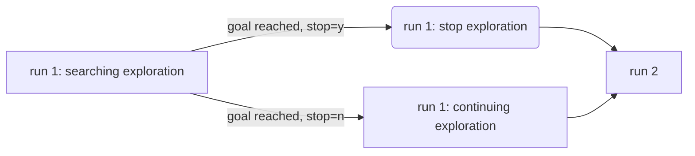

* The central class is `ExploredMaze`, which keeps all information of the maze currently explored by the mouse. Everytime sensor information is fed in `Robot.next_move(sensors)`, `ExploredMaze` gets updated by via `ExploredMaze.sensor_update(loc, direction, depth)`. 

* Underlying `ExploredMaze` lies `Cell` class, to which most methods of `ExploredMaze` are deligated. `Cell` keeps information of one grid of the maze such as which neighbouring grids have been explored and if yes, whether the edge of the cell leads to a wall or another cell.

* With all exploratary information kept in `ExploredMaze`, abstract class is defined for each phase (except run 1 goal reached and stop exploration phase), encapsulating common interfaces for plug-and-play strategy. These abstract classes are

* `SearchingExploration` abstract class encapsulates interfaces in goal searching exploration stage.

* `ContinuingExploration` abstract class encapsulates interfaces in optimization exploration stage.

* `CalcShortestPath` abstract class encapsulates interfaces in 2nd run.


#### Challenges

There are three categories of challenges I faced during coding process
1. Code structure, or design pattern consideration:

  In order to encapsulate strategy into unified interface (abstract class actually) and minimize interactions between various methods or functions, I found myself always in refactoring obligation. 

	* I separated `ContinuingExploration` abstract class out of `SearchingExploration` because `ContinuingExploration.next_move(self, loc, heading, steps)` needs more parameter _steps_ than `SearchingExploration.(next_move(self, loc, heading)`.
	* Initially, I wrote one-step Dijkstra shortest path algorithm and multi-step one but found that most code is duplicate. So I did refactory and merged them together.

2. Issues in debugging of each strategy and make sure it is correctly implemented. Sometimes debugging became difficult due to stochastic nature.  I figured out and resolved serveral bugs until visualization helper script was fully developed. One important fact I discovered is that moving backword does not make the mouse reverse heading. This actually has fundamental impact on several strategies because moving back is very likely to cancel out further forward action. For instance, in `SearchingExploration_OneStepFavorUnexploredSpace` in case of dead end, I chose to stay as where it is while turning right instead of moving back.

3. Writing idimatic python with testable units and readable docstring. Unlike Java, Python does not have standard docstring, and I adopted numpy standard. In addition, I converted verbose code snippets into more functional style, gaining more expressiveness. Also, I tried to unify interfaces at my best efforts by employing both optional parameter and `*args` non-keyworded variable length arguments. I also adopted `namedtuple` whenever possible to make code more readable.


#### Class `ExploredMaze`

Key methods of `ExploredMaze` are listed below:

```python
    def sensor_update(self, loc, direction, depth):
        """
        Updates maze connectivity status with sensor information.
        """
        
    def loc_of_neighbour(self, loc, direction, step=1):
        """
        Return location relative to `loc`. If the resulting location is out of maze, None is returned.
        """
    
    def is_permissible(self, loc, direction, step=1):
        """
        Checks whether the mouse can move from a location along a direction according to current connectivity status.
        """
        
    def compute_reachable_cells(self, loc_start=(0, 0), loc_excluded=None):
        """
        Computes set of cells that can be reached from (0, 0).
        """        
```


### Refinement

A\* algorithm servers the core of the project but lots of detailed debugging issues and code refactoring or design pattern cost much more time.

One typical debugging example is due to the fact that moving backword does not make the mouse change heading. In initial implementation of `SearchingExploration_OneStepWeightedRandom.next_move()`, weight of moving backward is supported but it caused problem of excessing 1000 step limit. Until visualization with heading is provided is issue identified and resolved.


## IV. Results

### Model Evaluation and Validation

| Combined Strategy  | Maze 1 | Maze 2| Maze 3|
| ------------- | ------------- | ------------- | ------------- |
| **Benchmark**<br>One-Step Random Turn<br>Multi-Step Dijkstra Shortest Path<br>*No Optimization Exploration* | <u>50.99</u> | <u>58.65</u> |<u>62.91</u>  |
| One-Step Favoring Unexplored Space<br>Multi-Step Dijkstra Shortest Path <br>*No Continuing Exploration*| <u>77.79</u> |<u>89.03</u>  |<u>100</u>  |
| One-Step Weighted Random Turn (weights=[3, 5, 3])<br>Multi-Step Dijkstra Shortest Path<br>*No Optimization Exploration* | <u>42.38</u> | <u>78.34</u> |<u>42.59</u>  |
| Multi-Step Goal Oriented (A\*) <br>One-Step Dijkstra Shortest Path <br>*No Continuing Exploration*| 32.033 |48.667  |56.600  |
| Multi-Step Goal Oriented (A\*) <br>Multi-Step Dijkstra Shortest Path <br>*No Continuing Exploration*| **19.033** |**27.667**  |**32.60**  |
| Multi-Step Goal Oriented (A\*) <br>Multi-Step Dijkstra Shortest Path with Sensor Updates <br>*No Continuing Exploration*| 19.033 |27.667  |32.60  |
| Multi-Step Goal Oriented (A\*) <br>Multi-Step Dijkstra Shortest Path <br>*Cover All Goals*| 19.100 |27.733  |32.667  |
Note that score with <u>underscore</u> means the result is stochastic, and is averaged across 5 trials. If a trial exceeds 1000 step in exploration run, 100 is given as penalty score. The concrete trial scores are listed below.

| Combined Strategy  | Maze 1 | Maze 2| Maze 3|
| ------------- | ------------- | ------------- | ------------- |
| **Benchmark**<br>One-Step Random Turn<br>Multi-Step Dijkstra Shortest Path<br>*No Optimization Exploration* | 39.33<br>22.23<br>100<br>49.33<br>44.07 | 100<br>35.667<br>100<br>29.633<br>27.967 | 100<br>100<br>46.667<br>35.267<br>32.633 |
| One-Step Favoring Unexplored Space<br>Multi-Step Dijkstra Shortest Path <br>*No Continuing Exploration*|43.367<br>100<br>45.567<br>100<br>100 | 100<br>45.167<br>100<br>100<br>100 | 100<br>100<br>100<br>100<br>100 |
| One-Step Weighted Random Turn (weights=[3, 5, 3])<br>Multi-Step Dijkstra Shortest Path<br>*No Optimization Exploration* | 37.433<br>28.133<br>24.1<br>100<br>22.233 | 42.8<br>100<br>48.9<br>100<br>100 | 30.733<br>31.133<br>42.4<br>53.367<br>55.333|


### Justification

| Combined Strategy  | Maze 1 | Maze 2| Maze 3|
| ------------- | ------------- | ------------- | ------------- |
| **Benchmark**<br>One-Step Random Turn<br>Multi-Step Dijkstra Shortest Path<br>*No Optimization Exploration* | <u>50.99</u> | <u>58.65</u> |<u>62.91</u>  |
| Multi-Step Goal Oriented (A\*) <br>Multi-Step Dijkstra Shortest Path <br>*No Continuing Exploration*| **19.033** |**27.667**  |**32.60**  |

The best model outperformed the benchmark model substaintially. And due to its deterministric nature, the result can always be reproduced. Actually, running *tester.py* without modifying `robot.py` would reproduce these scores.

Further looking at the traces of mouse actions in second run, we found that in all 3 mazes, the mouse actually followed optimal routes. Finding optimal route is not guaranteed by Multi-Step Goal Oriented (A\*) strategy but it does demonstrate in most cases this strategy works good enough.

#### Solution Robustness
Let's talk about solution robustness, i.e. will the solution always reach goals within 1000 steps in first run?  It really depends on maze size. Now let's restrict the maze size of 12, 14 and 16. The two biggest types of penalty for this strategy (or any other strategies) is that it makes a bad guess and runs all the way down to a dead end and it goes back and forth (turning around) to different areas of unexplored cells.

Consider following extreme cases:

* Most cells of the maze are connected, causing the mouse to cross already fully explored cell clusters to arrive at unexplored cells at different clusters in each turn. But since most cells are connected, it would be adequate to allow 5~10 times manhattan distance from starting cell to goal cells. In case of 16x16 maze, the manhattan distance from starting cell to goal cells is $(16/2-1)*2 = 14$, resulting in max of $10*14=140$ steps.

* ​Continue the aforementioned case and suppose the maze is constructed in a way that cells are not that much connected but appropriately connected such that there are several dead ends and turning around to expand remote cells is unavoidable, let's see how severely turning around cost could possibly be.

  First notice the fact that for action steps of two unexplored cells greater than certain value (around 4 - 6), the mouse would continue to explore cells in the same cluster, not going back and forth to different frontier cell clusters. This is because only if 

  $manhattan\_dist\_to\_goal(cell\_in\_remote\_cluster) + estimated\_steps(k, cell\_in\_remote\_cluster) $ **is greater than** $manhattan\_dist\_to\_goal(cell\_in\_current\_cluster) + estimated\_steps(k, cell\_in\_current\_cluster) $ 

  would turning around happen. 

  $manhattan\_dist\_to\_goal(x)$ is constant, given $x$.

  $estimated\_steps(k, cell\_in\_current\_cluster)$ is smaller compared to $estimated\_steps(k, cell\_in\_remote\_cluster) $. Therefore there is no chance to mouse to turn back once steps of two unexplored cells greater than certain value.

  Second, let's suppose there are several very deep dead end and the mouse always bets the wrong turn and at branching cell after reaching dead end, it is forced to go back and explore previous branching cell. This is the case where turning around is unavoidable. We can see easily that in such case, the mouse would follow each route at most twice, e.g. explore and back off, which is approximately $2*total\_cells$, or $2*16^2=512$ in case of 16x16 maze. Taking account of moving at step 3 and case above, turning around among near by clusters. The overall number would not exceed 1000 for 16x16 maze.


## V. Conclusion

### Free-Form Visualization

Multi-Step Goal Oriented (A\*) exploration in 3 test mazes are drawn below. 

Route in 12x12 maze:

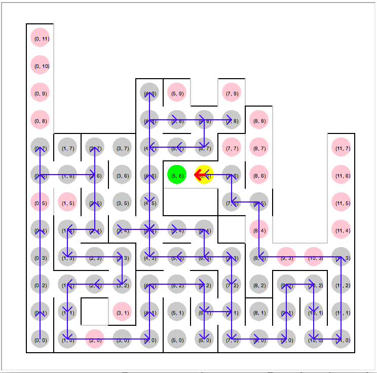


Route in 14x14 maze:
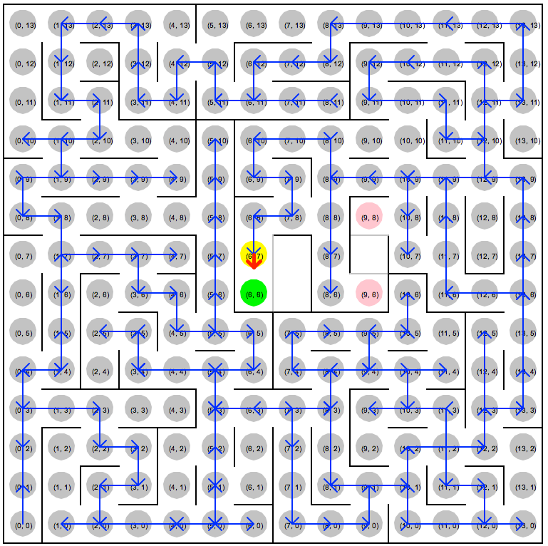


Route in 16x16 maze:
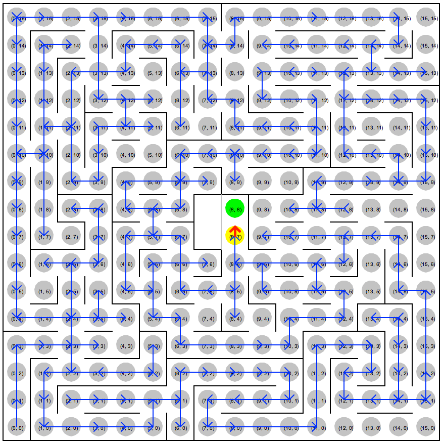

Routes in 14x14 and 16x16 maze are not clearly graphed but it is easy to spot for those who look at whole turtle drawing process. From the routes taken by the mouse, it further confirms my reasoning in [Solution Robustness section](#solution-robustness) that it would take at most $2*maze\_size^2$ steps. Actually, the mouse almost explored fully in 14x14 and 16x16 maze and its corresponding steps taken is 168 for 14x14 and 226 for 16x16.


### Reflection

Before the capstone project, I have implemented various graph algorithms but not A\* algorithm. This project gave me an opportunity to implement a slightly harder version of A\* with even more challenging reasoning on its robustness and effectiveness. I got myself familiar with theoretic aspects of A\* algorithm, e.g. admissible and consistent properties.

What's more, I started to get to know more sophisticated search algorithms

* Incremental Replanning Algorithm, e.g. D\* and D\* Lite
* Anytime Algorithm, e.g. ARA\*
* Anytime Replanning Algorithm, e.g. AD\*


Developing visualizaiton script *vis.py* cost me one full day but it paid back in terms of helping me a lot to find and correct bugs in several strategies and also helping to consolidate reasoning of A\* exploration validity.


### Improvement
There are several things in my opinion that can get improved.

1. Implement coverage threshold continuing exploration strategy and see if there is score increase or decrease.

2. `SearchingExploration_GoalOriented` heuristic function is merely manhattan distance, actually with knowledge of explored maze, we can more approximate actual path from a cell to goals, by assuming no walls on all undiscovered edges, and have Dijkstra shortest path algorithm compute it. Let the new shortest path of $n$ be $Dijkstra\_partially\_explored\_maze(n)$. Now we have: 

   $$manhattan\_dist(n) <= Dijkstra\_partially\_explored\_maze(n) <= actual\_steps(n)  $$

   In this way, $Dijkstra\_partially\_explored\_maze(n)$ is closer to actual steps from $n$ to goals, but still remains admissible property, implying better A\* implementation than current one.

3. In `SearchingExploration_GoalOriented` and `DijkstraStrideWithUpdates` , `dijkstra_shortest_path()` function is called several times. This is very inefficient because there are few status updates between successive calls. A family of dedicated algorithms exist, most notably D* Lite algorithm would help a lot.

4. Identify several typical cases in optimization exploration stage, such as what is mentioned in **With More AI** so that mouse is encouraged to continue exploring when finding shortcut opportunity is high but discouraged vice versa.

4. Currently, visualization module (*vis.py*) using Turtle library is slow, partial update can be employed to accerelate rendering process by providing live action.