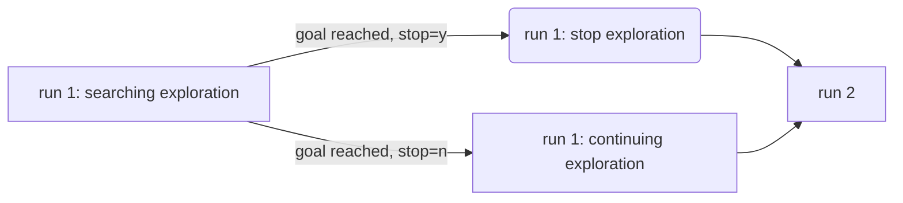

# Machine Learning Engineer Nanodegree
## Capstone Project
Frank Ding  
2018

## I. Definition
### Project Overview
This capstone project is well defined by  [Udacity MLND Robot Motion Planning Capstone Project - Plot and Navigate a Virtual Maze](https://docs.google.com/document/d/1ZFCH6jS3A5At7_v5IUM5OpAXJYiutFuSIjTzV_E-vdE/pub) whose original idea takes inspiration from Micromouse competitions, which originated in the late 1970s as an event where small robot mice solve a 16 x 16 maze. The autonomous micromouse robot is placed in a corner of the maze and is taksked to reach maze center. The mouse is given two runs in the maze. In the first run, it attempts to map out the maze to not only find the center, but also figure out the best paths to the center. In second run, the micromouse robot aims to reach the center in the fastest time possible.


### Problem Statement
The goal is to design a algorithm that makes the micromouse robot find the center as quick as possible. To be most efficient includes not only the moves in the second run but also the moves in the first run, ie. explore the maze in an efficient way. More concretely, the score is defined as follows
$$ Score = NumSteps_1/30 + NumSteps_2 $$ 

where $NumSteps_1 < 1000$ and $NumSteps_2 < 1000$

The rationale of the metric is fully explained in [Metrics section](#metrics).


The guiding problem solving principles are

* In second run, calculate a shortest path using partial knowledge of the maze acquired in first run because trials in second run would not be economical since exploration incurs 1/30 cost in trial stage than in second stage.
* In first run, the robot is required to reach goal due to first principle. Since there is restriction on total number of steps and also number of steps in this stage has metric impact, it's wise for the robot to reach goal in minimal steps. This stage in first run is called **goal searching exploration** in this report.
* And if remaining steps allowed, the robot can explore other unexplored squares as many as possible in the maze in most efficient way in the hope to find shortcut path for next stage. This continuing exploration in first run can be considered as optimization so it is called **continuing exploration** in this report.  It must make trade-off between the number of step expected to be taken and number of steps that a promising shortcut path could reduce compared to existing shortest path.

Hence, the first principle would lead naturally to calculating shortest path using Dijkstra shortest path algorithm.

The second principle would make us find quickest paths while exploring using graph traveral algorithms such as A* search algorithms because aimless wondering would increase the possibility of failing to reach goal.

(todo modify)

The third principle forces designers to use graph traversal algorithms more towards depth first search than breadth first search because breadth first search incurs more step cost due to back and forth movements. However, how to exploit existing knowledge of the maze would be a decisive factor.

It should be noted that although it is encouraged to reach goal first as second principle states, we are not sure how much the continuing exploration after reaching goal could contribute to success of finding shortcuts having better score.


### Metrics
The evaluation metric is listed below
$$ Score = NumSteps_1/30 + NumSteps_2 $$

where $NumSteps_1$ is number of steps taken in first run and $NumSteps_2$ is number of steps in second run.

The total score only considers total steps taken in test run but also involves steps in exploration run. Consider why it is necessary to include steps in exploration run. Suppose total score only considered step number in test run, i.e $Score = NumSteps_2$, robot is encouraged to take arbitrary time probing the maze and have a complete knowledge of the maze. Then in the second run, some deterministic  shortest path algorithm can be employed to return minimal steps. The overall result would be every robot has the optimal score for a particular maze though they have wide range of steps probing the maze. Worst is that some robot may never terminiate in exploration run. 


## optimization ##

explore during 2 run

D* lite

continue exploration


## II. Analysis
_(approx. 2-4 pages)_

### Data Exploration
In this section, you will be expected to analyze the data you are using for the problem. This data can either be in the form of a dataset (or datasets), input data (or input files), or even an environment. The type of data should be thoroughly described and, if possible, have basic statistics and information presented (such as discussion of input features or defining characteristics about the input or environment). Any abnormalities or interesting qualities about the data that may need to be addressed have been identified (such as features that need to be transformed or the possibility of outliers). Questions to ask yourself when writing this section:
- _If a dataset is present for this problem, have you thoroughly discussed certain features about the dataset? Has a data sample been provided to the reader?_
- _If a dataset is present for this problem, are statistics about the dataset calculated and reported? Have any relevant results from this calculation been discussed?_
- _If a dataset is **not** present for this problem, has discussion been made about the input space or input data for your problem?_
- _Are there any abnormalities or characteristics about the input space or dataset that need to be addressed? (categorical variables, missing values, outliers, etc.)_

### Exploratory Visualization
In this section, you will need to provide some form of visualization that summarizes or extracts a relevant characteristic or feature about the data. The visualization should adequately support the data being used. Discuss why this visualization was chosen and how it is relevant. Questions to ask yourself when writing this section:
- _Have you visualized a relevant characteristic or feature about the dataset or input data?_
- _Is the visualization thoroughly analyzed and discussed?_
- _If a plot is provided, are the axes, title, and datum clearly defined?_

### Algorithms and Techniques
According to [Problem Statement section](#problem-statement), there are 3 stages: goal searching exploration, optimization exploration and second trial.

#### a. Strategies in goal searching exploration 

The corresponding abstract class is `SearchingExploration` described in [Implementation section](#implementation)

**One-Step Random Turn**

**One-Step Weighted Random Turn**

**One-Step Towards Unexplored Cell**

**One-Step Towards Unexplored Space**

**Multi-Step Goal Oriented**  `SearchingExploration_GoalOriented`

#### b. Strategies in second trial

The corresponding abstract class is `ShortestPath` described in [Implementation section](#implementation)

**One-Step Dijkstra Shortest Path**
**Multi-Step Dijkstra Shortest Path**
**Multi-Step Dijkstra Shortest Path with Updates**

#### c. Strategies in optimization exploration

The corresponding abstract class is `XXX` described in [Implementation section](#implementation)

**Coverage**
**Trade-off**


In this section, you will need to discuss the algorithms and techniques you intend to use for solving the problem. You should justify the use of each one based on the characteristics of the problem and the problem domain. Questions to ask yourself when writing this section:

- _Are the algorithms you will use, including any default variables/parameters in the project clearly defined?_
- _Are the techniques to be used thoroughly discussed and justified?_
- _Is it made clear how the input data or datasets will be handled by the algorithms and techniques chosen?_

### Benchmark
In this section, you will need to provide a clearly defined benchmark result or threshold for comparing across performances obtained by your solution. The reasoning behind the benchmark (in the case where it is not an established result) should be discussed. Questions to ask yourself when writing this section:
- _Has some result or value been provided that acts as a benchmark for measuring performance?_
- _Is it clear how this result or value was obtained (whether by data or by hypothesis)?_


## III. Methodology
### Data Preprocessing
In this section, all of your preprocessing steps will need to be clearly documented, if any were necessary. From the previous section, any of the abnormalities or characteristics that you identified about the dataset will be addressed and corrected here. Questions to ask yourself when writing this section:
- _If the algorithms chosen require preprocessing steps like feature selection or feature transformations, have they been properly documented?_
- _Based on the **Data Exploration** section, if there were abnormalities or characteristics that needed to be addressed, have they been properly corrected?_
- _If no preprocessing is needed, has it been made clear why?_

### Implementation
#### Implementation Principles
As Udacity machine learning capstone project, I want to achieve following implementation standards

* Readable: code is clearly documented and easy to be understood
* Composable: in order to test and compare different strategies of 3 phases identified in [Problem Statement section](#problem-statement), I abstracted each phase to one abstract class. Concrete strategy implements corresponding abstract class and is plugged into `Robot` constructor.
* Testable: those common routines such as manhattan distance, dijkstra shortest path algorithm, are separated out as standalone functions for test and resuable purposes. A dedicated unit test python script *robot_test.py* is provided.
* Diagnosable: Visualization of maze exploration status and its location and heading is implemented in *vis.py* script. In addition, I added defensive checks using Exception in several methods to enable quick failure so that I can corrrect my code as soon as possible.

#### Summary of key components

* `Robot.next_move(sensors)` defines 4 phases: run 1 searching exploration, run 1 goal reached and stop exploration, run 1 goal reached and continue exploration and run 2 phase. The phase transition graph is shown below.



* The central class is `ExploredMaze`, which keeps all information of the maze currently explored by the mouse. Everytime sensor information is fed in `Robot.next_move(sensors)`, `ExploredMaze` gets updated by calling `ExploredMaze.sensor_update(loc, direction, depth)`. 

* Underlying `ExploredMaze` lies `Cell` class, to which most methods of `ExploredMaze` are deligated. `Cell` keeps information of one grid of the maze such as which neighbouring grids have been explored and if yes, whether the edge of the cell leads to a wall or another cell.

* With all exploratary information kept in `ExploredMaze`, abstract class is defined for each phase (except run 1 goal reached and stop exploration phase), encapsulating common interfaces for plug-and-play strategy. These abstract classes are

* `SearchingExploration` corresponds to goal searching exploration stage.

* `RunShortestPath` corresponds to 2nd run.

#### Skeleton of `Robot.next_move()`

#### Class `ExploredMaze`

Key methods of `ExploredMaze` are listed below:

```python
class ExploredMaze(object):

    """
    Updates maze connectivity status with sensor information.
    
    Parameters
    ----------
    loc : tuple (int, int)
        Tuple of location, in format of (0, 0).
    direction : int
        Must be D_DOWN, D_LEFT, D_UP, D_RIGHT.
    depth : int
        0 indicates wall;
        other positive number indicating how far from this `loc` mouse can move forward.
    
    """
    def sensor_update(self, loc, direction, depth)
    
    
    """
    Return location relative to `loc`. If the resulting location is out of maze, None is returned.
    
    Parameters
    ----------
    loc : tuple (int, int)
        Tuple of location, in format of (0, 0).
    direction : int
        Must be D_DOWN, D_LEFT, D_UP, D_RIGHT.
    step : int
        distance to `loc`, optional
    
    Returns
    -------
    new_location: tuple of (rotation: int, movement: int), or None
        None when out of maze.
    """
    def loc_of_neighbour(self, loc, direction, step=1)
    
    """
    Checks whether the mouse can move from a location along a direction according to current connectivity status.
    
    Parameters
    ----------
    loc : tuple (int, int)
        Tuple of location, in format of (0, 0).
    direction : int
        Must be D_DOWN, D_LEFT, D_UP, D_RIGHT.
    step : int
        distance to `loc`, optional
    
    Returns
    -------
    is_permissible: True, False, None
        None indicates there is not enough information along the way, i.e. not sure there is wall between two cells in the way.
    """
    def is_permissible(self, loc, direction, step=1)
    
    """
    Computes set of cells that can be reached from (0, 0).
    
    Parameters
    ----------
    
    Returns
    -------
    reached_set: set of location tuple (int, int)
    """
    def compute_reachable_cells(self)

```


#### Class `Cell`

```python
class Cell(object):
    
    """
    Connects this cell with a neighbouring cell and vice versa.
    
    Parameters
    ----------
    direction : int
        Must be D_DOWN, D_LEFT, D_UP, D_RIGHT.
    node : tuple (int, int)
        neighbouring location.
        
    Raises
    ------
    Exception
        When wall between these 2 nodes already established.
    """
    def connect(self, direction, node)
        
    """
    Sets a wall to one edge of current cell.
    
    Parameters
    ----------
    direction : int
        Must be D_DOWN, D_LEFT, D_UP, D_RIGHT, the direction relative to current cell.
    
    Raises
    ------
    Exception
        When these 2 nodes are already connected.
    """
    def set_wall(self, direction)
    
    """
    Checks whether the mouse can move one step from current cell along the direction.
    
    Parameters
    ----------
    direction : int
        Must be D_DOWN, D_LEFT, D_UP, D_RIGHT.
    
    Returns
    -------
    is_permissible: True, False, None
        None indicates there is not enough information, i.e. not sure there is wall in that direction.
    """
    def is_permissible(self, direction)
    
    """
    Gets all connected neighbours currently explored.
    
    Parameters
    ----------
    
    Returns
    -------
    neighbour_list: list of location tuple (int, int)
    """
    def get_neighbours(self)

```


```python
class SearchingExploration(object):
    
    """
    Decides next move according to `loc` and its `heading`.

    Parameters
    ----------
    loc : tuple (int, int)
        Tuple of location, in format of (0, 0).
    heading : int
        Must be D_DOWN, D_LEFT, D_UP, D_RIGHT.
    
    Returns
    -------
    next_action : tuple of (rotation: int, movement: int)
        For example: (90, 3).
    """
    @abc.abstractmethod
    def next_move(self, loc, heading)
    
```


```python
class RunShortestPath(object):

    """
    Computes list of actions that would follow shortest path starting `loc_start` with `heading`.

    Parameters
    ----------
    loc_start : tuple (int, int)
        Tuple of location, in format of (0, 0).
    heading : int
        Must be D_DOWN, D_LEFT, D_UP, D_RIGHT.

    Returns
    -------
    action_list : list of tuple (rotation: int, movement: int)
        For example: [(90, 3), [0, 3)]
    """
    @abc.abstractmethod
    def compute_p2p_action(self, loc_start, heading, *args)
```


### Refinement
In this section, you will need to discuss the process of improvement you made upon the algorithms and techniques you used in your implementation. For example, adjusting parameters for certain models to acquire improved solutions would fall under the refinement category. Your initial and final solutions should be reported, as well as any significant intermediate results as necessary. Questions to ask yourself when writing this section:
- _Has an initial solution been found and clearly reported?_
- _Is the process of improvement clearly documented, such as what techniques were used?_
- _Are intermediate and final solutions clearly reported as the process is improved?_


## IV. Results
_(approx. 2-3 pages)_

### Model Evaluation and Validation
In this section, the final model and any supporting qualities should be evaluated in detail. It should be clear how the final model was derived and why this model was chosen. In addition, some type of analysis should be used to validate the robustness of this model and its solution, such as manipulating the input data or environment to see how the model’s solution is affected (this is called sensitivity analysis). Questions to ask yourself when writing this section:
- _Is the final model reasonable and aligning with solution expectations? Are the final parameters of the model appropriate?_
- _Has the final model been tested with various inputs to evaluate whether the model generalizes well to unseen data?_
- _Is the model robust enough for the problem? Do small perturbations (changes) in training data or the input space greatly affect the results?_
- _Can results found from the model be trusted?_

### Justification
In this section, your model’s final solution and its results should be compared to the benchmark you established earlier in the project using some type of statistical analysis. You should also justify whether these results and the solution are significant enough to have solved the problem posed in the project. Questions to ask yourself when writing this section:
- _Are the final results found stronger than the benchmark result reported earlier?_
- _Have you thoroughly analyzed and discussed the final solution?_
- _Is the final solution significant enough to have solved the problem?_


## V. Conclusion
_(approx. 1-2 pages)_

### Free-Form Visualization
In this section, you will need to provide some form of visualization that emphasizes an important quality about the project. It is much more free-form, but should reasonably support a significant result or characteristic about the problem that you want to discuss. Questions to ask yourself when writing this section:
- _Have you visualized a relevant or important quality about the problem, dataset, input data, or results?_
- _Is the visualization thoroughly analyzed and discussed?_
- _If a plot is provided, are the axes, title, and datum clearly defined?_

### Reflection
In this section, you will summarize the entire end-to-end problem solution and discuss one or two particular aspects of the project you found interesting or difficult. You are expected to reflect on the project as a whole to show that you have a firm understanding of the entire process employed in your work. Questions to ask yourself when writing this section:
- _Have you thoroughly summarized the entire process you used for this project?_
- _Were there any interesting aspects of the project?_
- _Were there any difficult aspects of the project?_
- _Does the final model and solution fit your expectations for the problem, and should it be used in a general setting to solve these types of problems?_

### Improvement
In this section, you will need to provide discussion as to how one aspect of the implementation you designed could be improved. As an example, consider ways your implementation can be made more general, and what would need to be modified. You do not need to make this improvement, but the potential solutions resulting from these changes are considered and compared/contrasted to your current solution. Questions to ask yourself when writing this section:
- _Are there further improvements that could be made on the algorithms or techniques you used in this project?_
- _Were there algorithms or techniques you researched that you did not know how to implement, but would consider using if you knew how?_
- _If you used your final solution as the new benchmark, do you think an even better solution exists?_

-----------

**Before submitting, ask yourself. . .**

- Does the project report you’ve written follow a well-organized structure similar to that of the project template?
- Is each section (particularly **Analysis** and **Methodology**) written in a clear, concise and specific fashion? Are there any ambiguous terms or phrases that need clarification?
- Would the intended audience of your project be able to understand your analysis, methods, and results?
- Have you properly proof-read your project report to assure there are minimal grammatical and spelling mistakes?
- Are all the resources used for this project correctly cited and referenced?
- Is the code that implements your solution easily readable and properly commented?
- Does the code execute without error and produce results similar to those reported?
