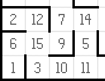

# Machine Learning Engineer Nanodegree
## Capstone Proposal
Frank Ding

2018

## Proposal
### Domain Background
Robot Motion Planning project takes inspiration from Micromouse competitions, which originated in the late 1970s as an event where small robot mice solve a 16 x 16 maze. The autonomous micromouse robot is placed in a corner of the maze and is taksked to reach maze center. The mouse is given two runs in the maze. In the first run, it attempts to map out the maze to not only find the center, but also figure out the best paths to the center. In second run, the micromouse robot aims to reach the center in the fastest time possible.

### Problem Statement
The goal is to design a algorithm that makes the micromouse robot find the center as quick as possible. To be most efficient includes not only the moves in the second run but also the moves in the first run, ie. explore the maze in an efficient way.

The maze exists on an n x n grid of squares, where n=12, 14, or 16. Along the outside perimeter of the grid, and on the edges connecting some of the internal squares, are walls that block all movement. The robot will start in the square in the bottom- left corner of the grid, facing upwards. The starting square will always have a wall on its right side (in addition to the outside walls on the left and bottom) and an opening on its top side. In the center of the grid is the goal room consisting of a 2 x 2 square; the robot must make it here 
from its starting square in order to register a successful run of the maze.

The robot can be considered to rest in the center of the square it is currently located in, and points in one of the cardinal directions of the maze. The robot has three obstacle sensors, mounted on the front of the robot, its right side, and its left side. Obstacle sensors detect the number of open squares in the direction of the sensor; for example, in its starting position, the robot’s left and right sensors will state that there are no open squares in those directions and at least one square towards its front. On each time step of the simulation, the robot may choose to rotate clockwise or counterclockwise ninety degrees, then move forwards or backwards a distance of up to three units. It is assumed that the robot’s turning and movement is perfect. If the robot tries to move into a wall, the robot stays where it is. After movement, one time step has passed, and the sensors return readings for the open squares in the robot’s new location and/or orientation to start the next time unit.

More technically, at the start of a time step the robot will receive sensor readings as a list of three numbers indicating the number of open squares in front of the left, center, and right sensors (in that order) to its “next_move” function. The “next_move” function must then return two values indicating the robot’s rotation and movement on that timestep. Rotation is expected to be an integer taking one of three values: -90, 90, or 0, indicating a counterclockwise, clockwise, or no rotation, respectively. Movement follows rotation, and is expected to be an integer in the range [-3, 3] inclusive. The robot will attempt to move that many squares forward (positive) or backwards (negative), stopping movement if it encounters a wall.

### Datasets and Inputs
The only input is maze specification, provided as a text file. On the first line of the text file is a number describing the number of squares on each dimension of the maze n. On the following n lines, there will be n comma-delimited numbers describing which edges of the square are open to movement. Each number represents a four-bit number that has a bit value of 0 if an edge is closed (walled) and 1 if an edge is open (no wall); the 1s register corresponds with the upwards-facing side, the 2s register the right side, the 4s register the bottom side, and the 8s register the left side. For example, the number 10 means that a square is open on the left and right, with walls on top and bottom (0\*1 + 1\*2 + 0\*4 + 1\*8 = 10). Note that, due to array indexing, the first data row in the text file corresponds with the leftmost column in the maze, its first element being the starting square (bottom-left) corner of the maze.

### Evaluation Metrics

The evaluation metric is listed below
$$ Score = NumSteps_1/30 + NumSteps_2 $$

where $NumSteps_1$ is number of steps taken in first run and $NumSteps_2$ is number of steps in second run.

The total score only considers total steps taken in test run but also involves steps in exploration run. Suppose total score only considered step number in test run, i.e $Score = NumSteps_2$, robot is encouraged to take arbitrary time probing the maze and have a complete knowledge of the maze. Then in the second run, some deterministic  shortest path algorithm can be employed to return minimal steps. The overall result would be every robot has the optimal score for a particular maze though they have wide range of steps probing the maze. Worst is that some robot may never terminiate in exploration run. 

### Solution Statement

The robot is granted to have 1000 steps totally in first and second run. According to the evaluation matric discussed above

$$ Score = NumSteps_1/30 + NumSteps_2 $$

The main principles are

* In second run, calculate a shortest path using partial knowledge of the maze acquired in first run because trial in second run would not be economical since exploration incurs 1/30 cost in trial stage.
* In first run, the robot is required to reach goal due to first principle. Since there is restriction on total number of steps and also number of steps in this stage has metric impact, it's wise for the robot to reach goal in minimal steps
* And if remaining steps allowed, the robot can explore other unexplored squares as many as possible in the maze in most efficient way in the hope to find shortcut for next stage.

Hence, the first principle would lead naturally to calculating shortest path using Dijkstra shortest path algorithm.

The second principle would make us find quickest paths while exploring using graph traveral algorithms such as A* or Bellman Flood-fill search algorithms because aimless wondering would increase the possibility of failing to reach goal.

The third principle forces designers to use graph traversal algorithms more towards depth first search than breadth first search because breadth first search incurs more step cost due to back and forth movements. However, how to exploit existing knowledge of the maze would be a decisive factor.

It should be noted that although it is encouraged to reach goal first as second principle states, we are not sure how much the continuing exploration after reaching goal could contribute to success of finding shortcuts having better score.

### Benchmark Model

As discussed in *Solution Statement* section, a benchmark model could be

* For the first principle, use Dijkstra shortest path algorithm

* For the second principle, use a random decision when exploring an unknown path. In case of dead end, return to most previous square that still has unknown paths. The algorithm repeats until step exausted or reaching goal.

* For the third principle, the robot first determines if there is still steps left for this continuing exploration stage, which is $TrialNumberInExploration/30 + DijkstraShortestStepsCurrently < 1000$, then it is allowed to use a depth first search algorithm exploring unknown paths in similar random decision way as in previous stage.

  ​

### Project Design

According to *Solution Statement*, optimization can be done for stages corresponding to 2nd and 3rd principles, i.e. the stage in first run **before** and **after** reaching goal. So we can try different strategies for both stages.

In stage **before** reaching goal, possible strategies could be

* A* search algorithm
* Bellman Flood-fill search algorithm

In stage **after** reaching goal, possible strategies could be

* Depth first graph traversal
* Breadth first graph traversal

Some other important parameters are 

* *MinimalStepsIfNoWalls*, which is manhattan distance between starting point and goal
* *StepsRemainingContinuingExplorating*, which is $1000-StepsTakenInExplorationStage- DijkstraShortestPathCurrently$. The parameter indicates in continuing exploration stage, we need to calculate shortest path using current knowledge for each step if new path is found.

These parameters have impact on strategies in continuing exploration stage. So we can have grid search using these parameters and specific parameters in each strategy.

It is worth noting that although it is possible to compute utility of continuting searching, i.e. how many steps can be reduced if a shortcut is found given current knowledge of the maze and how many actions would need to find the shortcut. Consider following cases. If the shortest path computed using current knowledge is already equal to manhatton distance between starting point and goal, then there is no gain to explore any areas even though there are many unexplored squares. Another case is that if the currently found shortest path has detours having shortcut connecting two squares in the path and shortcut is not explored, then it is highly worthwhile to give it a try. 

Though the idea of computing utility of continuting searching in each step is inspiring, it is far more complicated to have a comprehensive quantitative approach and hence not considered in this project.

### Project Library ###
* Python 2.7

  ​

### References ###

1. [Robot Motion Planning Capstone Project - https://docs.google.com/document/d/1ZFCH6jS3A5At7_v5IUM5OpAXJYiutFuSIjTzV_E-vdE/pub](https://docs.google.com/document/d/1ZFCH6jS3A5At7_v5IUM5OpAXJYiutFuSIjTzV_E-vdE/pub)
2. [Wikipedia Micromouse - https://en.wikipedia.org/wiki/Micromouse](https://en.wikipedia.org/wiki/Micromouse)​